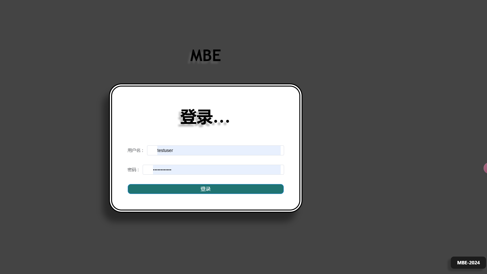
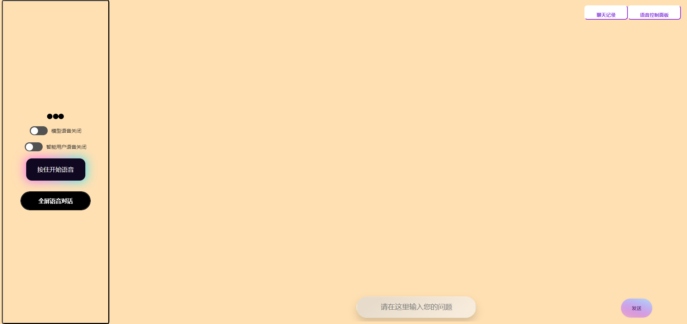
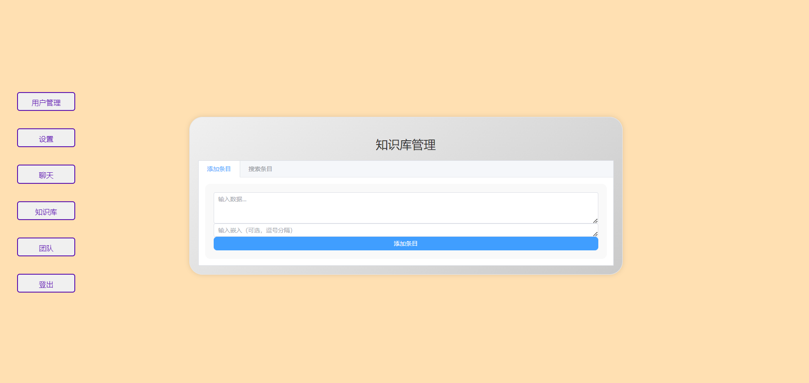

# MBE

## Mindful Bot Engine-思维bot

使用技术栈：Flask,LangChain,Vue,postgreSQL,ChatTTS,faster-whisper,sklearn,Crawl4AI。

#### 界面展示

使用方法：

1.安装postgreSQL数据库（Linux）

`sudo apt install postgresql postgresql-contrib`

`sudo systemctl start postgresql`

2.克隆文件：

`git clone https://github.com/Guiwith/MBE.git`

3.创建虚拟环境：

`python -m venv MBE`

并激活虚拟环境

4.安装依赖：

`pip install -r requirement.txt`

5.查看CreateTable文件夹中的Create_table.py，创建数据库（推荐直接创建管理员admin账户）。

6.创建.env文件：

`JWT_SECRET_KEY='YOURKEY'`

`DB_HOST='localhost'`

`DB_NAME='YOURDATABASE'`

`DB_USER='postgres'`

`DB_PASSWORD='12345'`

`OLLAMA_HOST='http://localhost:11434'`

`LLM_MODEL='YOURMODEL'`

`GLOBAL_BACKGROUND_COLOR='#737373'`

`CHAT_HISTORY_BACKGROUND_COLOR='#161616'`

`USER_MESSAGE_BACKGROUND_COLOR='#FFFFFF'`

`USER_MESSAGE_TEXT_COLOR='#2A2A2A'`

`MODEL_MESSAGE_BACKGROUND_COLOR='#212121'`

`MODEL_MESSAGE_TEXT_COLOR='#F4F4F4'`

`DEFAULT_LOCALE='zh'`

`BASE_URL='http://127.0.0.1:5050'`

7.运行App.py：

`python app.py`

或

`python3 app.py`

#### 注意事项：

首次安装faster-whisper和ChatTTS会安装模型，如遇下载出错请自行百度搜索或提出issue。